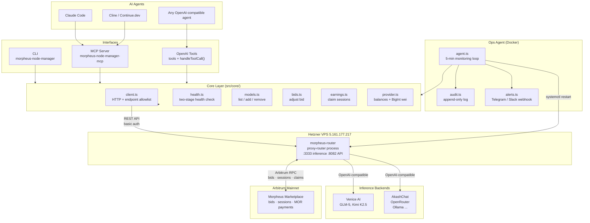

# morpheus-node-manager

A portable Node.js/TypeScript tool for managing a [Morpheus Lumerin](https://mor.org) AI inference provider node. It exposes all provider operations—health checks, model management, bid adjustment, earnings claiming, and balance monitoring—through three interfaces: a CLI for terminal use, an MCP server for AI coding agents (Claude Code, Cline, Continue.dev, OpenCode), and an OpenAI function-calling schema for any agent using the OpenAI tools API. An optional autonomous ops agent monitors the node on a configurable interval, auto-claims earnings, alerts on low balances, and restarts the proxy-router when it goes down.

---

## Architecture



---

## Quick start

```bash
npm install -g morpheus-node-manager

# Check node health (process alive + blockchain connected)
morpheus-node-manager status --url http://localhost:8082 --password admin

# List marketplace models with your active bids highlighted
morpheus-node-manager models

# Check ETH and MOR wallet balances
morpheus-node-manager balances

# Register a new model with an opening bid
morpheus-node-manager add-model \
  --name "glm-4-9b" \
  --ipfs-cid QmYourModelCard \
  --stake-wei 100000000000000000 \
  --price-wei 100000000 \
  --api-type openai \
  --api-url https://api.venice.ai/api/v1 \
  --api-key YOUR_VENICE_KEY \
  --model-name glm-4-9b
```

Requires Node.js >= 22.

---

## The 8 tools

| Tool | What it does |
|------|--------------|
| `node_status` | Two-stage health check: first confirms the process responds to `/healthcheck`, then verifies blockchain connectivity via `/blockchain/latestBlock`. Returns wallet address, formatted ETH/MOR balances, active bid count, active session count, and provider registration status. |
| `list_models` | All models registered on the Morpheus marketplace. Your active bids are surfaced inline on each model (`myBid` field) with current price and bid ID. |
| `add_model` | Register a model on-chain and post an opening bid in a single call. Accepts all 6 proxy-router backend `apiType` values. Returns the new model ID and bid ID. |
| `remove_model` | Remove a model and all your bids for it. Requires a `confirm` token of the form `DELETE_MODEL_<first8chars>` to prevent accidental deletion. |
| `adjust_bid` | Update your price for a model. Deletes the existing bid and posts a new one. Note: there is a brief (<1s) bid gap between the delete and re-post. |
| `claim_earnings` | Inspect and claim MOR from completed provider sessions. Supports dry-run mode, per-call claim caps, and a minimum claimable threshold. |
| `check_balances` | ETH and MOR balances for the node wallet, returned in both human-readable format (`0.05 ETH`) and raw wei. |
| `provider_info` | Provider registration record: stake, fee (basis points), registered endpoint, and all currently active bids. |

---

## CLI reference

```
morpheus-node-manager <command> [options]

Commands:
  status          Check node health and status
  models          List marketplace models and your bids
  add-model       Register a new model on the marketplace
  remove-model    Remove a model (requires --model-id and --confirm)
  adjust-bid      Adjust your bid price for a model
  claim           Claim earnings from provider sessions
  balances        Check ETH and MOR balances
  provider        Show provider registration info

Global options:
  --url <url>       Proxy-router API URL (default: http://localhost:8082)
  --user <user>     API basic auth user (default: admin)
  --password <pwd>  API basic auth password
  --cookie <path>   Path to proxy-router .cookie file
  --insecure        Allow http:// for non-localhost URLs (trusted networks only)
```

All commands return JSON to stdout. The `status` command exits with code 1 if the node is unhealthy, making it suitable for use in shell scripts and health checks.

**Examples:**

```bash
# Claim up to 5 sessions, minimum 0.001 MOR each
morpheus-node-manager claim --max-claims 5 --min-claimable 1000000000000000

# Dry-run: see what's claimable without submitting transactions
morpheus-node-manager claim --dry-run

# Adjust bid price
morpheus-node-manager adjust-bid --model-id 0xabcdef1234... --price-wei 200000000

# Remove a model (first 8 chars of model ID required in confirm token)
morpheus-node-manager remove-model \
  --model-id 0xabcdef1234567890 \
  --confirm DELETE_MODEL_0xabcdef

# Read password from proxy-router .cookie file automatically
morpheus-node-manager status --cookie /path/to/proxy-router/.cookie
```

---

## Supported inference backends

Any OpenAI-compatible endpoint works with `--api-type openai`. These providers are ready to use:

| Provider | Base URL | Notes |
|----------|----------|-------|
| Venice AI | `https://api.venice.ai/api/v1` | DIEM credits; free tier available |
| AkashChat | `https://chatapi.akash.network/api/v1` | Always free |
| AkashML | `https://api.akashml.com/v1` | $100 signup credit |
| NEAR AI | `https://cloud-api.near.ai/v1` | Beta; free |
| OpenRouter | `https://openrouter.ai/api/v1` | 300+ models; USDC accepted |
| Together AI | `https://api.together.xyz/v1` | $25 credit |
| Hyperbolic | `https://api.hyperbolic.xyz/v1` | Free tier; use `openai` type for LLM, `hyperbolic-sd` for image gen |
| Local Ollama | `http://localhost:11434/v1` | Self-hosted; always free |

For Anthropic Claude directly, use `--api-type claudeai`. For image generation, use `prodia-v2`, `prodia-sd`, `prodia-sdxl`, or `hyperbolic-sd`.

---

## MCP server

The MCP server exposes all 8 tools over stdio, compatible with any MCP client.

**Claude Code** (`~/.claude/claude_desktop_config.json` or `.mcp.json`):

```json
{
  "mcpServers": {
    "morpheus": {
      "command": "node",
      "args": ["/path/to/morpheus-node-manager/dist/mcp-server.js"],
      "env": {
        "MORPHEUS_API_URL": "http://localhost:8082",
        "MORPHEUS_API_PASSWORD": "your-password"
      }
    }
  }
}
```

**Cline** (`.clinerules` or MCP settings):

```json
{
  "mcpServers": {
    "morpheus": {
      "command": "morpheus-node-manager-mcp",
      "env": {
        "MORPHEUS_API_URL": "http://localhost:8082",
        "MORPHEUS_API_PASSWORD": "your-password"
      }
    }
  }
}
```

If installed globally via npm, the binary `morpheus-node-manager-mcp` is available directly. Otherwise point to `dist/mcp-server.js` with `node`.

The MCP server reads configuration from environment variables. All `MORPHEUS_*` env vars apply (see [Configuration](#configuration)).

---

## OpenAI tools

For agents using the OpenAI tools API directly:

```typescript
import { tools, handleToolCall } from 'morpheus-node-manager';

const config = {
  apiUrl: 'http://localhost:8082',
  apiUser: 'admin',
  apiPassword: 'your-password',
};

// Pass tools to your OpenAI API call
const response = await openai.chat.completions.create({
  model: 'gpt-4o',
  messages,
  tools,
  tool_choice: 'auto',
});

// Handle tool calls from the response
for (const call of response.choices[0].message.tool_calls ?? []) {
  const result = await handleToolCall(
    call.function.name,
    JSON.parse(call.function.arguments),
    config
  );
  // result is a JSON string — add to messages as a tool response
}
```

`tools` is a static array of OpenAI function-calling schema objects. `handleToolCall(name, args, config)` dispatches to the appropriate core function and returns a JSON string result. Both are typed exports from `dist/index.js`.

---

## Ops agent

An autonomous monitoring daemon that runs on a configurable interval (default: every 5 minutes).

**What it does each cycle:**

1. Two-stage health check — if the node is unhealthy, restarts the proxy-router service (systemctl on Linux, launchctl on macOS) up to `maxConsecutiveRestarts` times before alerting and stopping
2. Balance check — sends an alert if ETH or MOR drops below configured thresholds
3. Auto-claim — claims earnings from completed sessions, respecting a per-cycle cap and minimum claimable amount
4. Bid presence check — alerts if any registered model has no active bid

**Circuit breakers:**

- Restart cap: stops auto-restarting after `maxConsecutiveRestarts` consecutive failures and sends a critical alert
- Claim rate limit: per-session timestamps prevent redundant claim attempts
- Lockfile: prevents concurrent runs (stale locks are detected and cleared)
- Startup grace: non-critical alerts suppressed until 2 consecutive healthy checks

**Running the ops agent:**

```bash
# One-shot check (suitable for cron)
node dist/ops-agent/index.js --once --config /etc/morpheus-node-manager/config.json

# Daemon mode (runs continuously on configured interval)
node dist/ops-agent/index.js --config /etc/morpheus-node-manager/config.json
```

**Configuration** — copy `templates/config.example.json` and edit:

```json
{
  "apiUrl": "http://localhost:8082",
  "apiUser": "admin",
  "apiPassword": "CHANGE_ME",
  "checkIntervalMs": 300000,
  "thresholds": {
    "minMorWei": "500000000000000000",
    "minEthWei": "10000000000000000"
  },
  "autoClaim": true,
  "maxClaimsPerCycle": 5,
  "autoRestart": true,
  "maxConsecutiveRestarts": 3,
  "alerts": {
    "webhookUrl": "",
    "type": "generic"
  }
}
```

`type` accepts `"telegram"`, `"slack"`, or `"generic"` (generic sends a JSON POST with `{ title, body, severity }`).

**Deployment templates** are in `templates/`:

- `morpheus-ops-agent.service` + `morpheus-ops-agent.timer` — systemd (Linux)
- `com.morpheus.ops-agent.plist` — launchd (macOS)

The ops agent writes an append-only JSON audit log (`audit.json` by default) recording every health check, claim, restart, and alert. State is persisted to `state.json` across runs.

---

## Security

The HTTP client enforces a strict allowlist. Any endpoint not on the list throws before making a network request. The following endpoints are additionally blocked regardless of allowlist position:

| Blocked path | Reason |
|---|---|
| `POST /blockchain/send/eth` | Irreversible ETH transfer |
| `POST /blockchain/send/mor` | Irreversible MOR transfer |
| `DELETE /wallet` | Removes the wallet entirely |
| `POST /wallet/mnemonic` | Replaces the wallet seed phrase |
| `POST /wallet/privateKey` | Replaces the wallet private key |
| `GET /docker/*` | Remote code execution risk |
| `GET /ipfs/download/*` | Path traversal risk |

Additional security behaviors:

- **`remove_model` confirmation token.** The tool requires `confirm: "DELETE_MODEL_<first8chars_of_modelId>"`. This is enforced in code before any API call is made. The wrong token throws `Confirmation mismatch`.
- **HTTPS enforcement.** `http://` is refused for non-localhost URLs. Use `--insecure` or `MORPHEUS_INSECURE=true` only when connecting over an SSH tunnel, VPN, or private network you control.
- **Config file permissions.** `~/.morpheus-node-manager.json` is written with mode `0600`. The config loader warns if the file is group- or world-readable.
- **`adjust_bid` gap.** Adjusting a bid deletes the old bid before posting the new one. For high-traffic models, plan bid adjustments during low-traffic windows.

---

## Configuration

Priority order: CLI flags > environment variables > `~/.morpheus-node-manager.json` > `.cookie` file > defaults.

| Environment variable | CLI flag | Description | Default |
|---|---|---|---|
| `MORPHEUS_API_URL` | `--url` | Proxy-router REST API URL | `http://localhost:8082` |
| `MORPHEUS_API_USER` | `--user` | Basic auth username | `admin` |
| `MORPHEUS_API_PASSWORD` | `--password` | Basic auth password | _(empty)_ |
| `MORPHEUS_COOKIE_PATH` | `--cookie` | Path to proxy-router `.cookie` file | _(none)_ |
| `MORPHEUS_INSECURE` | `--insecure` | Allow `http://` for non-localhost | `false` |

The `.cookie` file is the password file written by the proxy-router at startup. If the file contains `user:password`, only the password portion is used.

To persist configuration so you don't have to pass flags every time:

```bash
# Write config manually
cat > ~/.morpheus-node-manager.json << EOF
{
  "apiUrl": "http://localhost:8082",
  "apiUser": "admin",
  "apiPassword": "your-password"
}
EOF
chmod 600 ~/.morpheus-node-manager.json
```

---

## Build from source

```bash
git clone https://github.com/betterbrand/Morpheus-skilled-agent.git
cd Morpheus-skilled-agent
npm install
npm run build
npm test
```

The test suite runs 21 tests against an in-process mock HTTP server — no running proxy-router required. Tests cover the client allowlist, health check logic, balance formatting (BigInt-safe), bid active/inactive detection, model listing, `remove_model` confirmation guard, and config HTTPS enforcement.

```
npm test

  client allowlist
    - blocks POST /blockchain/send/eth
    - blocks DELETE /wallet
    - blocks POST /wallet/privateKey
    - blocks GET /docker/anything
    - blocks GET /ipfs/download/file

  node_status
    - returns healthy when both healthcheck and latestBlock succeed
    - includes formatted balances
    - reports activeBids from wrapped response

  checkBalances
    - returns formatted ETH and MOR (lowercase API keys)

  weiToFormatted
    - formats 1 ETH correctly
    - formats 0.05 ETH correctly
    - handles BigInt safely (no precision loss at large values)

  bidIsActive
    - treats DeletedAt='0' as active
    - treats DeletedAt=null as active
    - treats non-zero DeletedAt as inactive

  listModels
    - returns models with bid info from wrapped response

  removeModel confirmation guard
    - rejects wrong confirm token
    - accepts correct DELETE_MODEL_<first8> token

  config
    - rejects http:// for remote URLs
    - allows http:// for localhost
    - allows http:// for remote with --insecure
    - strips trailing slash from URL

ℹ tests 21
✓ pass 21
```

---

## About Morpheus

[Morpheus](https://mor.org) is a decentralized AI marketplace. Providers stake MOR tokens, register models, and post bids to sell inference capacity to users. The proxy-router is the provider's node software: it manages sessions, validates payments on-chain, and routes inference requests to a backend (Venice AI, AkashChat, OpenRouter, local Ollama, etc.). This tool wraps the proxy-router's REST API to make provider operations scriptable and agent-accessible.

**Published at:** https://github.com/betterbrand/Morpheus-skilled-agent
