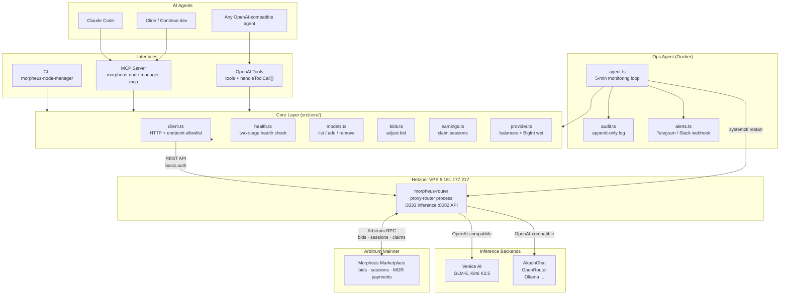

# Architecture

## Components

### Interfaces

All three interfaces share the same core layer. The interface you choose depends on how you want to interact with the node:

- **CLI** -- direct terminal commands, scriptable, JSON output to stdout
- **MCP Server** -- stdio-based protocol for AI coding agents
- **OpenAI Tools** -- function-calling schema for any OpenAI-compatible agent

### Core Layer

The core layer (`src/core/`) contains the business logic:

- **client.ts** -- HTTP client with a strict endpoint allowlist. Dangerous endpoints (ETH/MOR transfers, wallet operations) are blocked before any network request is made.
- **health.ts** -- Two-stage health check: first confirms the process responds, then verifies blockchain connectivity.
- **models.ts** -- List, add, and remove models from the Morpheus marketplace.
- **bids.ts** -- Adjust bid pricing. Deletes the old bid and posts a new one with minimal gap.
- **earnings.ts** -- Inspect and claim MOR from completed provider sessions.
- **provider.ts** -- Provider registration info, balances, and BigInt-safe wei utilities.

### Ops Agent

A Docker-based autonomous monitoring daemon. Runs health checks, balance monitoring, auto-claiming, and bid presence verification on a configurable interval. See [Ops Agent](ops-agent.md) for details.

### Proxy-Router

The Morpheus proxy-router is the provider's node software. It listens on port 3333 for inference requests and port 8082 for the REST API. This tool wraps the REST API.
